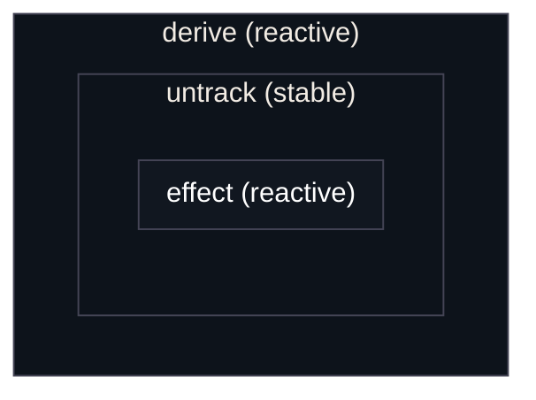

# Dynamic Scoping

Dynamic scoping is the act of creating and destroying new scopes in response to
source updates. This is needed for conditionally rendering parts of your UI,
such as opening and closing menus.

While Vide provides functions for common ways to do this, this section will
show how you can implement them yourself so you are not limited by only what is
provided.

## Recreating [`show()`](/api/reactivity-dynamic#show-reactive)

The most basic one, `show()`, can be
implemented yourself like so:

```luau
local function show(toggle: () -> unknown, component: () -> Instance)
    return derive(function()
        return if toggle() then untrack(component) else nil
    end)
end
```

The main thing to note here is the use of `untrack()`. This function runs its
callback in a new stable scope. Without this, if the component were to create
a reactive scope, an error would occur since a reactive scope cannot be created
within a reactive scope.



You can see from the above graph how the effect would not be created directly
inside the derive, there is a stable scope between them. This requirement exists
as a guard against unintentional rerendering of UI.

## Recreating [`switch()`](/api/reactivity-dynamic#switch-reactive)

```luau
local function switch(key)
    return function(map)
        return derive(function()
            local component = map[key()]
            return if component then untrack(component) else nil
        end)
    end
end
```

## Recreating [`indexes()`](/api/reactivity-dynamic#indexes-reactive)

This is a more complicated function because it manages multiple scopes at the
same time, unlike the previous functions. Because some scopes may persist
between reruns, we cannot use `untrack()` anymore which automatically destroys
on rerun; we must use `root()` where the lifetime of each scope is managed
manually and independently.

```luau
local function indexes<I, VI, VO>(
    input: () -> Map<I, VI>,
    transform: (value: () -> VI, index: I) -> VO
)
    local index_caches = {} :: Map<I, {
        previous_input: VI,
        output: VO,
        source: (VI) -> VI,
        destroy: () -> ()
    }?>

    -- destroy all scopes if the parent scope is destroyed
    cleanup(function()
        for _, cache in index_caches do
            assert(cache).destroy()
        end
    end)

    return derive(function()
        local new_input = input()

        -- destroy scopes of removed indexes
        for i, cache in index_caches do
            if new_input[i] == nil then
                assert(cache).destroy()
                index_caches[i] = nil
            end
        end

        -- create scopes or update sources of added or changed index values
        for i, v in new_input do
            local cache = index_caches[i]

            if cache == nil then -- no scope created for this index, create one
                local src = source(v)

                local destroy, result = root(function()
                    return transform(src, i)
                end)

                index_caches[i] = {
                    destroy = destroy,
                    source = src,
                    output = result,
                    previous_input = v
                }
            elseif cache.previous_input ~= v then -- scope exists, update source
                cache.previous_input = v
                cache.source(v)
            else -- scope exists and value has not changed; do nothing
            end
        end

        -- return the cached output values as an array
        local array = table.create(#index_caches)

        for _, cache in index_caches do
            table.insert(array, assert(cache).output)
        end
        
        return array
    end)
end
```

--------------------------------------------------------------------------------

Though the above functions are already provided to you by Vide, this serves as
an example for how you may create your own dynamic scope functions.
