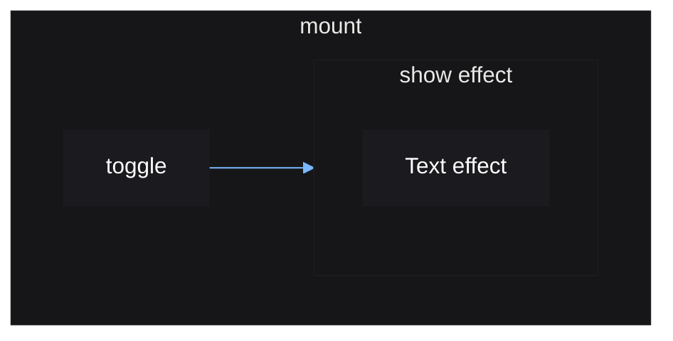
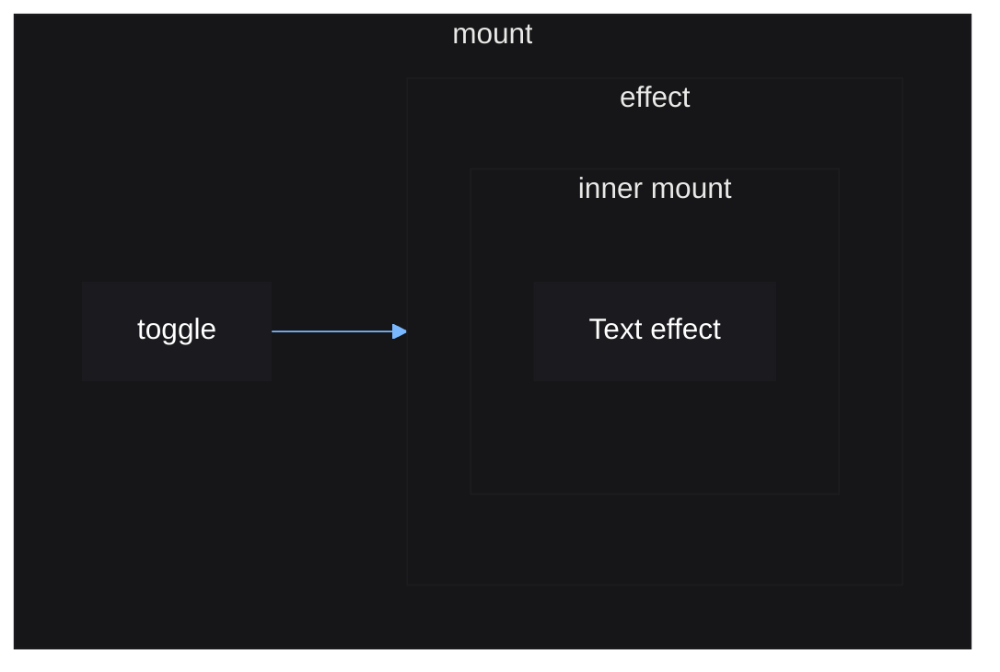
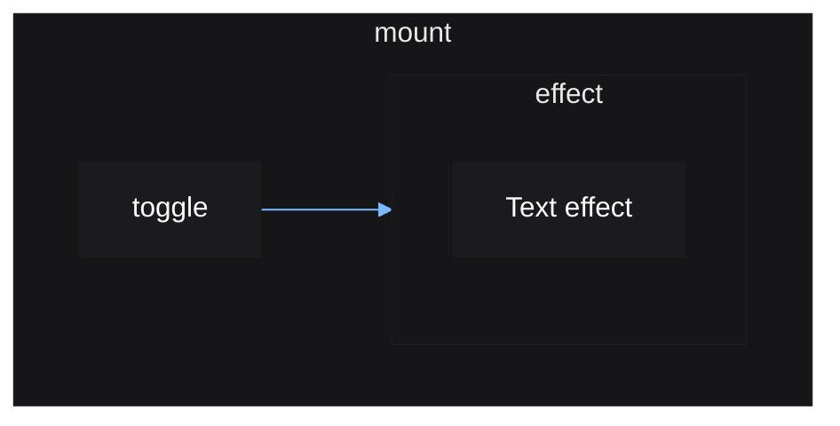

# Nested Scopes

Nesting scopes gives you finer control over the reactive graph, but needs more work to do. The built-in control flow functions try to cover the
most common cases, but they do not cover all of them.

This tutorial will demonstrate how to implement a `show()` control flow function
using just sources and effects.

```luau
local mount = vide.mount
local source = vide.source
local show = vide.show

local function Counter()
    local count = source(0)

    return create "TextButton" {
        Text = count,
        Activated = function() count(count() + 1) end
    }
end

root(function()
    local toggled = source(true)

    show(toggled, Button)
end)
```



Above is the reactive graph for `show()`. It creates a new effect depending on
`toggle` where anytime `toggle` is truthy, it will create a new `Counter`. The
`show` effect calls `Counter`, which creates a new reactive scope to update its
text whenever `count` changes. As per the rules of reactive scopes, a reactive
scope rerunning will destroy any scopes created within it. So the text
effect's reactive scope is destroyed whenever the show effect is rerun.

The same can be achieved without the use of `show()`:

```luau
local mount = vide.mount
local source = vide.source
local effect = vide.effect
local cleanup = vide.cleanup

local function Counter()
    local count = source(0)

    return create "TextButton" {
        Text = count,
        Activated = function() count(count() + 1) end
    }
end

mount(function()
    local toggled = source(true)

    effect(function()
        if toggled() then
            local destroy = root(function()
                Counter()
            end)
            cleanup(destroy)
        end
    end)
end)
```



This is another way to achieve the same. Here we use `root()` within the effect
to manually create and destroy a new stable scope whenever the effect reruns.

The reason for creating a stable scope is to prevent the effect from tracking
any sources that may be read inside the `Counter()` call. Otherwise, the effect
may be rerun needlessly and recreate the counter.

Alternatively, instead of using `root()`:

```luau
local mount = vide.mount
local source = vide.source
local effect = vide.effect
local untrack = vide.untrack

local function Counter()
    local count = source(0)

    return create "TextButton" {
        Text = count,
        Activated = function() count(count() + 1) end
    }
end

mount(function()
    local toggled = source(true)

    effect(function()
        if toggled() then
            untrack(Button)
        end
    end)
end)
```



Without the use of `untrack()`, an error would occur, since Vide does not allow
the creation of reactive scopes inside reactive scopes. `untrack()` creates a
stable scope inside the reactive scope, and we can create another reactive scope
inside that stable scope. The
reason for this, is because if the `Counter` component reads from a source
internally, that can cause the reactive scope calling `Counter()` to track that
source, causing unintentional reruns. As a guard against this, you are forced to
use `untrack()` to create nested reactive scopes.

The final result is the same as using the `show()` component. An effect is
created which creates the counter, which creates its own reactive scope. The
effect rerunning causes the counter's internal reactive scope to be destroyed,
making sure everything is cleaned up.
