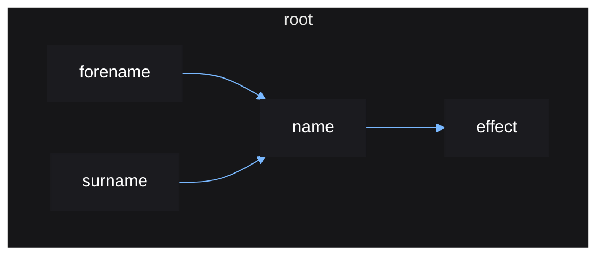
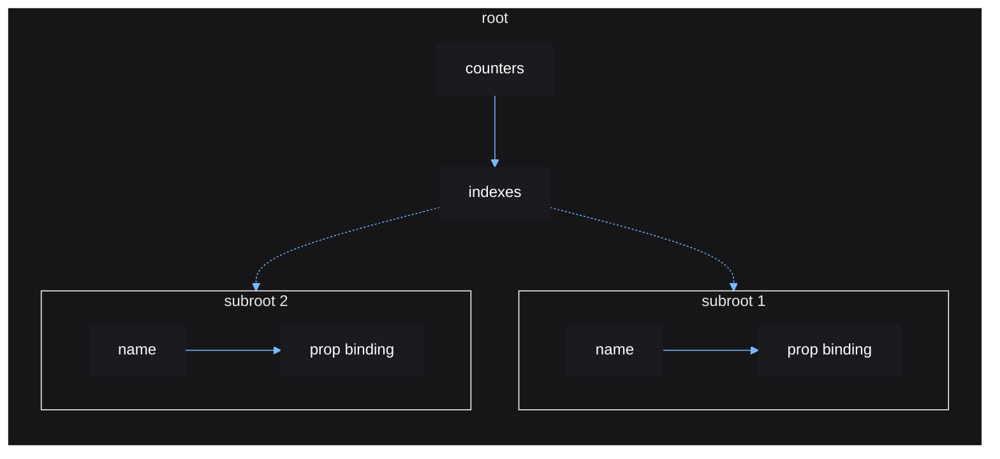
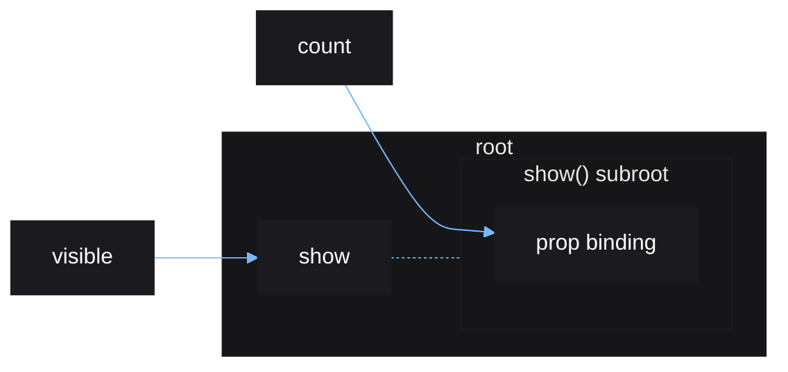

# Reactive Scoping

This is a brief document designed to give the user more insight into how Vide's
reactive system works.

## Graph Basics

Vide's reactivity can be represented as a graph, where each source, derived
source, and effect is a node on that graph. The term "*reactive scope*" is just
an abstraction used to refer to these nodes. Each node is a reactive scope.

Each node stores a cached value, a side-effect function, cleanup functions,
its parents and children, and its owner and owned.

Whenever a node is updated it will:

1. destroy its owned nodes
2. run its cleanups
3. rerun its side-effect and update its cached value
4. if its cached value changes, update its children recursively.

There is a difference between children nodes and owned nodes:

- children nodes are updated when a parent is updated.
- owned nodes are destroyed when a parent is updated.
- both children and owned are destroyed when a parent is destroyed.

Nodes created by `root()` generally have no children, and only tracks owned.
Nodes created by `derive()` generally have no owned, and only tracks children.

## Basic Example

```lua
root(function()
    local forename = source "quan"
    local surname = source "xi"
    
    local name = derive(function()
        return forename() .. " " .. surname()
    end)

    effect(function()
        print("new name: " .. name())
    end)
end)
```

This code will produce a graph that looks like so:



Nodes connected by arrows represent parent and children connections.
Nodes within other nodes represent owner and owned connections.

Any time a node is updated, Vide will traverse and update that node's children,
its children's children, etc, until all nodes descending from that node has been
updated. Traversal will stop at a node if that node's cached value does not
change after an update.

When the side-effect for a node is being reran when a node is updated, any
other nodes read within that side-effect are set as parents of the node
currently being reran. As those nodes are read, we know that the current node
depends on them, so any time those nodes are updated, they will update dependent
nodes since they will be stored as children.

When destroying a node, its descendents are traversed and also destroyed.
When being destroyed, a node's connections (parents and children, owner and
owned) are cleared, and any pending cleanup functions are ran.

The purpose of `root()` (which is called internally by `mount()`) is to setup
the root node which will track any node created inside its scope, or any
cleanups registered. Without it, nodes could be garbage collected without a
chance to run pending cleanups which can cause memory leakage.

Nodes created by `source()` can actually exist outside of root nodes, since
they do not have direct side-effects or cleanups, they do not have to be
explicitly destroyed.

## Control-flow Graph Example

Control flow functions in Vide are special, as they can dynamically create and
destroy new root scopes.

It is the combination of the above which allows us to write components like so:

```lua
local function Counter(props: { text: string })
    local count = source(0)

    local connection = stepped:Connect(function() count(count() + 1) end)

    cleanup(function() connection:Disconnect() end)

    return create "TextLabel" {
        Text = function()
            return props.text() .. ": " .. count()
        end
    }
end
```

Vide doesn't recognise this as a "component", that is a user abstraction. Vide
just sees this as a function that creates nodes in the reactive graph.

```lua
root(function()
    local counters = { "A", "B" }

    indexes(counters, function(name)
        return Counter { text = name }
    end)
end)
```

This code produces a graph like so:



This shows how the `indexes()` control flow function creates and manages new
root scopes. The function creates an effect seen as `indexes` in the graph,
which manages the new roots `subroot 1` and `subroot 2`, as well as the sources
`name` for which one exists for each index value in the input table.

When the input table changes, `indexes()` can automatically destroy and create
subroots based on the changed indexes. Destroyed nodes run any cleanups made, in
this case it is the cleanups to disconnect the counters connection. The same
applies to all other control flow functions.

Whenever the root reactive scope is destroyed, all its children, `counters` and
`indexes` will be destroyed too, which means that `indexes` children, the
subroots, will also be destroyed. Everything is nicely cleaned up.

## Custom Control-flow Example

Below is a simple example of the `show()` control-flow function.

Each time `visible` changes, `show()` will destroy the current reactive scope
and rerun its function in a new one.

```lua
local visible = source(true)
local count = source(0)

root(function()
    show(visible, function()
        return create "TextLabel" { Text = count }
    end)
end)
```

The above code produces a graph like so:



This can be recreated without the `show()` control-flow function, with the
following code:

```lua
local visible = source(true)
local count = source(0)

root(function()
    local output = derive(function()
        visible()

        -- untrack so any source read from within this scope
        -- will not cause the outer `derive()` call to rerun,
        -- we only want `derive()` to rerun when `visible` changes
        return untrack(function()
            local label = create "TextLabel" {}

            effect(function()
                label.Text = count()
            end)

            return label
        end)
    end)
end)
```

Both of the above code samples will produce the same visible result.
