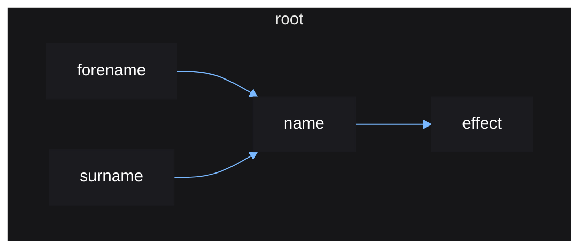
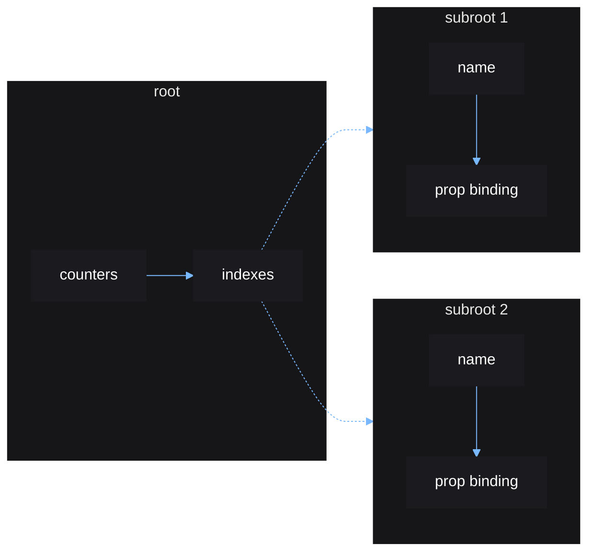

# Reactive Scoping

This is a brief document designed to give the user more insight into how Vide's
reactive system works.

Vide's reactivity can be pictured as a graph, where each source, derived source,
and effect is a node on that graph. For example:

```lua

root(function()
    local forename = source "quan"
    local surname = source "xi"
    
    local name = derive(function()
        return forename() .. " " .. surname()
    end)

    effect(function()
        print("new name: " .. name())
    end)
end)
```

Each time you create and derive sources, a new node representing that source is
created and added to the reactive graph. Each node stores a value and a
side-effect function. Each node also keeps track of its parents and children,
as well as any cleanups registered.

This code will produce a graph that looks like so:



Any time a node is updated, Vide will traverse and update that node's children,
its children's children, etc, until all nodes descending from that node has been
updated. Traversal will stop at a node if that node's cached value does not
change after an update.

For every node that is updated, a scope is opened for that node. These scopes
are referred to as "reactive scopes". Any source read from within a node's scope
will that node as a child. This is similar to cleanups, anytime a cleanup is
registered, it is added to the node of the currently active scope.

The way Vide tracks reactive scopes, is by using a stack of nodes. The current
active reactive scope is the node at the top of this stack.

When destroying a node, its descendents are traversed and also destroyed.
When being destroyed, a node's connections (parents and children) are cleared,
and any pending cleanup functions are ran.

The purpose of `root()` (which is called internally by `mount()`) is to setup
the root node which will track any node created or derived inside its scope, or
any cleanups registered. Without it, nodes could be garbage collected without a
chance to run pending cleanups which can cause memory leakage.

Nodes created by `source()` can actually exist outside of root nodes, since
they do not have direct side-effects or cleanups, they do not have to be
explicitly destroyed.

Control flow functions in Vide are special, as they can dynamically create and
destroy new root scopes.

It is the combination of the above which allows us to write components like so:

```lua
local function Counter(props: { text: string })
    local count = source(0)

    local connection = stepped:Connect(function() count(count() + 1) end)

    cleanup(function() connection:Disconnect() end)

    return create "TextLabel" {
        Text = function()
            return props.text() .. ": " .. count()
        end
    }
end
```

Vide doesn't recognise this as a "component", that is a user abstraction. Vide
just sees this as a function that creates nodes in the reactive graph.

```lua
root(function()
    local counters = { "A", "B" }

    indexes(counters, function(name)
        return Counter { text = name }
    end)
end)
```

This code produces a graph like so:



This shows how the `indexes()` control flow function creates and manages new
root scopes. The function creates an effect seen as `indexes` in the graph,
which manages the new roots `subroot 1` and `subroot 2`, as well as the sources
`name` for which one exists for each index value in the input table.

When the input table changes, `indexes()` can automatically destroy and create
subroots based on the changed indexes. Destroyed nodes run any cleanups made, in
this case it is the cleanups to disconnect the counters connection. The same
applies to all other control flow functions.

Whenever the root reactive scope is destroyed, all its children, `counters` and
`indexes` will be destroyed too, which means that `indexes` children, the
subroots, will also be destroyed. Everything is nicely cleaned up.
