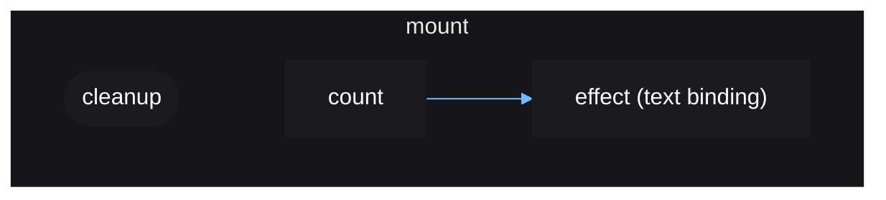

# Cleanup

Sometimes you may need to do some cleanup when destroying a component or after
a side-effect from a source update. Vide provides a function `cleanup()` which
is used to queue a cleanup callback for the next time a reactive scope re-runs.

```lua
local mount = vide.mount
local source = vide.source
local cleanup = vide.cleanup

local function Timer()
    local count = source(0)

    local con = game:GetService("RunService").Heartbeat:Connect(function(dt)
        count(count() + dt)
    end)

    cleanup(function()
        con:Disconnect()
    end)

    return create "TextButton" {
        Position = UDim2.fromOffset(300, 300),
        Size = UDim2.fromOffset(200, 50),

        Text = function()
            return "seconds: " .. math.floor(count())
        end,
    }
end

local unmount = mount(Timer)

unmount() -- all queued cleanups are ran, heartbeat connection stopped
```

In the above example, this allows us to disconnect the heartbeat connection
when the reactive scope responsible for creating the timer component is
destroyed, such as when it is unmounted.

Vide does not see "components", it only sees reactive scopes and how they are
linked together. Components are just a user pattern that creates UI instances
alongside effects. In other words, instances are just a side-effect of the
reactive graph. When a reactive scope is created, you create a corresponding
instance to display that data, when that reactive scope is destroyed, any
cleanups queued will be ran and take care of anything that needs to be, such
as disconnecting connections.

This is another reason why `mount()` is used at the top level of your app, so
that any registered cleanups created by your app components can be ran when
they are destroyed.

Side note: Roblox instances do not need to be explicitly destroyed for their
memory to be freed, they only need to be parented to `nil`. So there is no
need to use `cleanup()` to destroy instances. However, be wary of connecting
a function that references an instance to an event from the same instance,
this causes the instance to reference itself and never be freed. In such a case
you would need to use `cleanup()` to disconnect this connection or to explicitly
destroy the instance.

The reactive graph for the above example:


