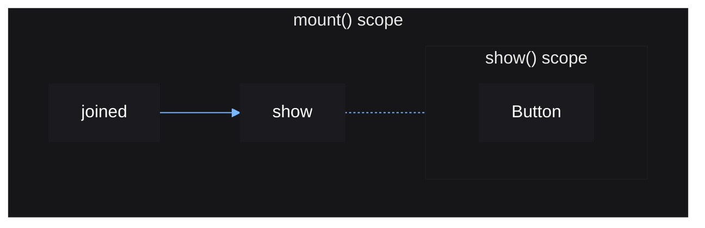
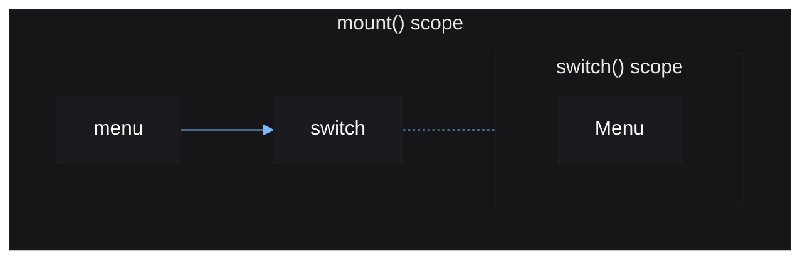
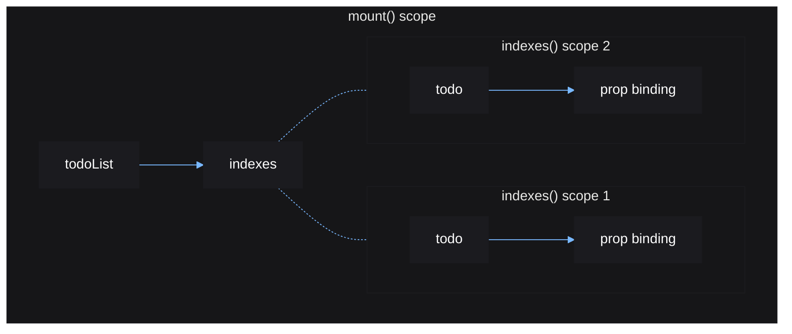

# Control Flow

Eventually you will need a way to dynamically create and destroy UI elements
resulting from source updates. Vide provides functions to help you do this,
known as *control flow* functions.

These functions return new sources, which hold the instances to be displayed.
These sources can be assigned as children, meaning the displayed children
will update when the input source updates.

Control flow functions are special, because they run their components in a new
reactive scope, which can be destroyed independently of the reactive scope that
called the control flow function itself. This means that parts of your app can
be independently created then destroyed.

## show()

The most basic control flow function is `show()`, which is used to conditionally
show a component.

```lua
local source = vide.source
local show = vide.show

local function JoinMenu()
    local joined = source(false)

    local function JoinButton()
        return Button {
            Activated = function() joined(true) end
        }
    end

    return create "Frame" {
        show(function() return not joined() end, JoinButton)
    }
end
```

This will make a button to join if you have not joined already.

You can also pass a third argument, a fallback to show if the condition is falsey.

```lua
local function JoinMenu()
    local joined = source(false)

    local function JoinButton()
        return Button {
            Activated = function() joined(true) end
        }
    end

    local function LeaveButton()
        return Button {
            Activated = function() joined(false) end
        }
    end

    return create "Frame" {
        show(joined, LeaveButton, JoinButton)
    }
end
```

The reactive graph for the above example:



`show()` will implicitly create an effect depending on `joined`, which can be
seen as `show` on the graph. This effect manages, and can create or destroy
a separate reactive scope seen as `show() scope` on the graph. The dotted line
indicates that it isn't actually connected, only indirectly managed through
code.

## switch()

Similar to `show()`, `switch()`, also condtionally displays one instance at a
time. It is more flexible since it can show one of many components, based on a
table used to map a source value to a component.

```lua
local source = vide.source
local switch = vide.switch

local function JoinMenu()
    local joined = source(false)

    local function JoinButton()
        return Button {
            Activated = function() joined(true) end
        }
    end

    local function LeaveButton()
        return Button {
            Activated = function() joined(false) end
        }
    end

    return create "Frame" {
        switch(joined) {
            [true] = LeaveButton,
            [false] = JoinButton
        }
    }
end
```

This example is equivalent to the previous one.

The switch can map any value to any component.

```lua
type ActiveMenu = "none" | "inventory" | "shop" | "settings"

local menu = source "inventory"

switch(menu) {
    inventory = InventoryMenu,
    shop = ShopMenu,
    settings = SettingsMenu
}
```

The reactive graph for the above example:



## indexes()

Often, you will have a table of values with each value displayed in a similar
manner. Rather than manually looping over each value to generate a corresponding
UI element, `indexes()` allows you to create elements for each table index, to
display the value at that index.

```lua
local todoList = source {
    "finish the crash course",
    "star vide's GitHub"
}

local function TodoList(props: { list: () -> Array<string> })
    return create "Frame" {
        create "UIListLayout" {},

        indexes(todoList, function(todo, i)
            return create "TextLabel" {
                Text = function()
                    return i .. ": " .. todo()
                end,

                LayoutOrder = i
            }
        end)
    }
end

TodoList { list = todoList }
```

For each index in the given source table, the given function will be called
with:

1. a source containing the value of the index
2. the index itself

When the value at an index is changed, the function is not reran. Instead, the
given source for that index is updated.

Any time the input source table is updated, the given function will be ran for
any newly added indexes, while any removed indexes (indexes now with a `nil`
value), will have its corresponding reactive scope destroyed to clean up that
element.

`indexes()` is said to *map* each table index to a new UI element that can
update to display the current value at that index.

The reactive graph for the above example:



One thing to note regarding table sources, is that when you edit a table in a
source, you must set that table again to actually update the source.

```lua
local src = source { 1, 2 }
local data = src()
table.insert(data, 3) -- no effects will run
src(data) -- effects will run
```

Together, these control flow functions cover the majority of cases where you
need to dynamically create and destroy parts of your UI.

If you need to do something that these control flow functions cannot, you can
always use `mount()` within an effect to dynamically create and destroy
components on your own terms. Just remember to use `cleanup()` to unmount when
the effect reruns.
