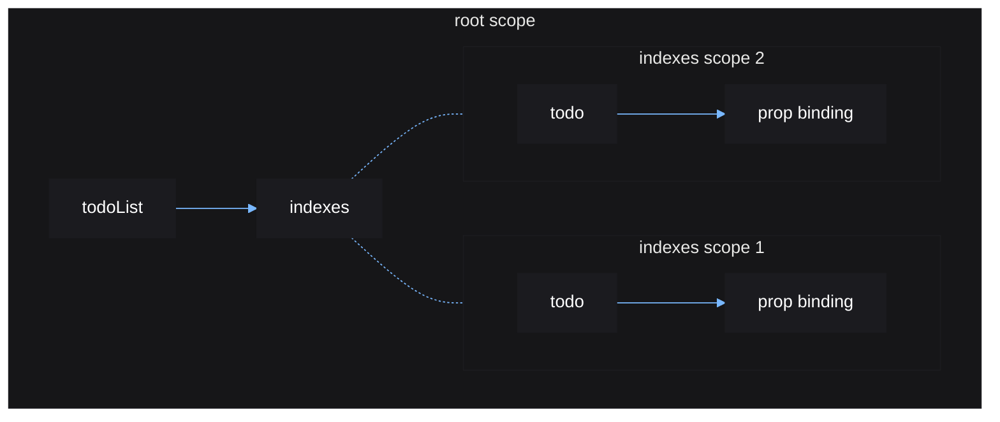

# Control Flow

Eventually you may need a way to dynamically create and destroy UI elements
resulting from source updates. Vide provides functions to help you do this,
known as *control flow* functions.

These functions return new sources, which hold the instances to be displayed.
The new sources can be used in `create()` to update the children of a container
instance.

## indexes()

`indexes()` *maps* each table index to a new UI element that can
update to display the current value at that index. Each table index is given a
single corresponding UI element.

```luau
local list = source {
    "finish the crash course",
    "star Vide's GitHub"
}

local function TodoList(props: { list: () -> Array<string> })
    return create "Frame" {
        create "UIListLayout" {},

        indexes(list, function(todo, i)
            return create "TextLabel" {
                Text = function()
                    return i .. ": " .. todo()
                end,

                LayoutOrder = i
            }
        end)
    }
end

TodoList { list = list }
```

For each index in the given source table, the given function to `indexes()` will
be run in a new stable scope with:

1. a source containing the value at the index
2. the index itself

When the value at an index is changed, the function is not reran. Instead, the
given source for that index is updated.

Any time the input source table is updated, the given function will be ran for
any newly added indexes, while any removed indexes (indexes now with a `nil`
value), will have its corresponding stable scope destroyed.


The reactive graph for the above example:



When you edit a table in a source, you must set that table again to actually
update the source.

```luau
local src = source { 1, 2 }
local data = src()
table.insert(data, 3) -- no effects will run
src(data) -- effects will run
```
