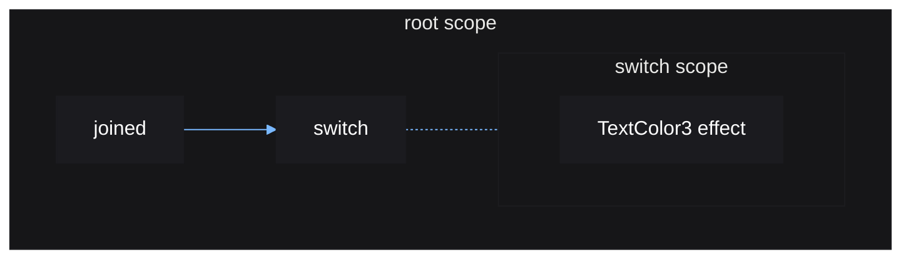
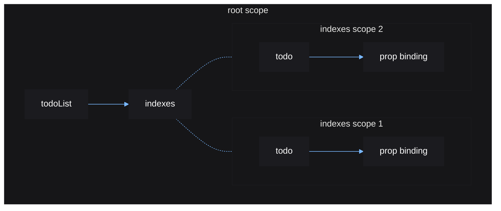

# Control Flow

Eventually you may need a way to dynamically create and destroy UI elements
resulting from source updates. Vide provides functions to help you do this,
known as *control flow* functions.

These functions return new sources, which hold the instances to be displayed.

Control flow functions run their components in a new reactive scope, which can
be destroyed independently of the reactive scope that called the control flow
function. This means parts of your app can be independently created and
destroyed.

## switch()

`switch()` condtionally displays one instance at a time. It uses a table to map
a source value to a component.

```lua
local source = vide.source
local switch = vide.switch

local function Button(props: {
    Text: string,
    Activated: () -> ()
})
    local hovered = source(false)

    return create "TextButton" {
        Text = props.Text,
        Activated = props.Activated,

        TextColor3 = function()
            return hovered() and Color3.new(1, 1, 1) or Color3.new(.7, .7, .7)
        end,

        MouseEnter = function() hovered(true) end,
        MouseLeave = function() hovered(false) end
    }
end

local function JoinMenu()
    local joined = source(false)

    local function JoinButton()
        return Button {
            Text = "Join",
            Activated = function() joined(true) end
        }
    end

    local function LeaveButton()
        return Button {
            Text = "Leave"
            Activated = function() joined(false) end
        }
    end

    return create "Frame" {
        switch(joined) {
            [true] = LeaveButton,
            [false] = JoinButton
        }
    }
end
```

The reactive graph for the above example:



A `switch()` call creates a new effect and a new scope as seen in the above
graph. Whenever `menu` updates, it causes the `switch` effect to run, which
will destroy and recreate the switch scope with the new component.

This will also destroy the internal effect that the button uses to highlight
itself when it is hovered, each time the switch is rerun.

## indexes()

Often, you will have a table of values with each value displayed in a similar
manner. Rather than manually looping over each value to generate a corresponding
UI element, `indexes()` allows you to create elements each corresponding to a
table index, to display the value at that index.

```lua
local todoList = source {
    "finish the crash course",
    "star vide's GitHub"
}

local function TodoList(props: { list: () -> Array<string> })
    return create "Frame" {
        create "UIListLayout" {},

        indexes(todoList, function(todo, i)
            return create "TextLabel" {
                Text = function()
                    return i .. ": " .. todo()
                end,

                LayoutOrder = i
            }
        end)
    }
end

TodoList { list = todoList }
```

For each index in the given source table, the given function will be called
with:

1. a source containing the value of the index
2. the index itself

When the value at an index is changed, the function is not reran. Instead, the
given source for that index is updated.

Any time the input source table is updated, the given function will be ran for
any newly added indexes, while any removed indexes (indexes now with a `nil`
value), will have its corresponding reactive scope destroyed to clean up that
element.

`indexes()` is said to *map* each table index to a new UI element that can
update to display the current value at that index. Each table index is given a
single corresponding UI element.

The reactive graph for the above example:



One thing to note regarding table sources, is that when you edit a table in a
source, you must set that table again to actually update the source.

```lua
local src = source { 1, 2 }
local data = src()
table.insert(data, 3) -- no effects will run
src(data) -- effects will run
```

Together, these control flow functions cover the majority of cases where you
need to dynamically create and destroy parts of your UI.

If you need to do something that these control flow functions cannot, you can
always use `mount()` within an effect to dynamically create and destroy
components on your own terms. Just remember to use `cleanup()` to unmount when
the effect reruns.
