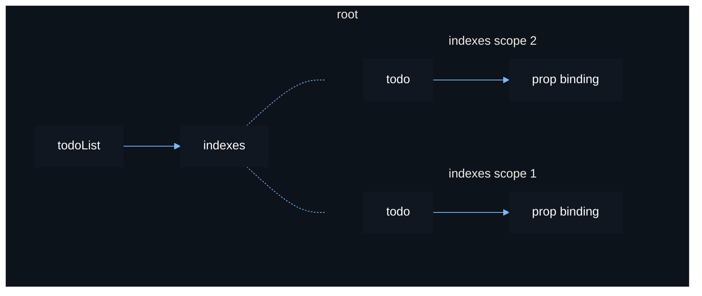

# Dynamic Scopes

Eventually you may need a way to dynamically create and destroy UI elements
resulting from source updates. Vide provides functions to help you do this,
known as *dynamic scope* functions.

These functions create and destroy scopes for you in response to source
updates. They return a source containing the created component. This source can
be parented as a child which will update the shown children whenever the source
updates.

The simplest example is using `show()`.

```luau
local source = vide.source
local create = vide.create
local show = vide.show
local root = vide.root

function Button(props: { Text: string, Activated: () -> () })
    return create "TextButton" {
        Text = props.Text,
        Activated = props.Activated
    }
end

function Menu()
    return create "TextLabel" {
        Text = "This is a menu"
    }
end

function App()
    local toggled = source(false)

    return create "ScreenGui" {
        Button {
            Text = "Toggle Menu",
            Activated = function()
                toggled(not toggled())
            end
        },

        show(toggled, Menu) -- [!code highlight]
    }
end

root(function()
    App().Parent = game.StarterGui
end)
```

This is a complete example of rendering UI which has a single button that
toggles the opening of a menu.

--------------------------------------------------------------------------------

Another common function is `indexes()`. This function creates a component for
each index in a table.

Each component created is done so in a new and independent stable scope. The
indexes of the table are checked each source update to prevent redunant
destruction and recreation of UI elements.

```luau
local source = vide.source
local create = vide.create
local indexes = vide.indexes
local root = vide.root

local function Todo(props: {
    Text: () -> string,
    Position: number,
    Activated: () -> ()
})
    return create "TextButton" {
        Text = function() return props.Position .. ": " .. props.Text() end,
        LayoutOrder = props.Position,
        Activated = Activated
    }
end

local function TodoList(props: { List: () -> Array<string> })
    return create "Frame" {
        create "UIListLayout" {},

        indexes(props.List, function(text, i)  -- [!code highlight]
            return Todo {
                Text = text,
                Position = i,
                Activated = function() -- remove the todo when clicked
                    local list = props.List()
                    table.remove(list, i)
                    props.List(list)
                end
            }
        end)
    }
end

function App()
    local list = source {
        "finish the crash course",
        "star Vide's GitHub"
    }

    return create "ScreenGui" {
        TodoList { List = list },
    }
end

root(function()
    App().Parent = game.StarterGui
end)
```

The reactive graph for the above example:



When you edit a table in a source, you must set that table again to actually
update the source.

```luau
local src = source { 1, 2 }
local data = src()
table.insert(data, 3) -- no effects will run
src(data) -- effects will run
```

--------------------------------------------------------------------------------

All dynamic scope functions also support delaying the destruction of the scope.
This is useful for playing any sort of animation or effect before the UI
instance is removed.

If you have the following code, for example:

```lua
local function Menu()
    return create "Frame" {}
end

local toggled = source(true)

create "ScreenGui" {
    show(toggled, function()
        return Menu {}
    end)
}

toggled(false) -- menu will disappear immediately
```

```lua
local function Menu(props: { Visible: () -> boolean })
    local transparency = spring(function()
        return if p.Visible then 0 else 1
    end

    return create "Frame" {
        BackgroundTransparency = transparency
    }
end

local toggled = source(true)

create "ScreenGui" {
    show(toggled, function(_, present)
        return Menu { p.Visible = present }, 3 -- give a generous 3 seconds for the spring to complete before destroying
    end)
}

toggled(false)
-- `present` will go `false` immediately
-- transparency will begin being sprung
-- after 3 seconds the scope is destroyed, giving the spring enough time to complete
```

If `toggled` goes from truthy to falsey, beginning the timer, but then back
to truthy before the timer finishes, the timer is cancelled and the scope is
not destroyed.
