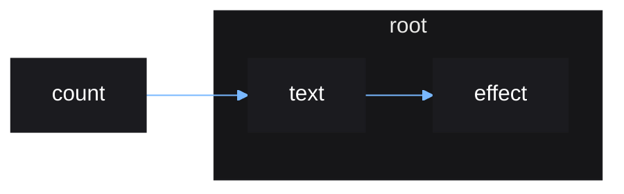

# Concepts Summary

A summary of all the concepts covered during the crash course.

## Source

A source of data.

Stores a single value that can be updated.

Created with `source()`.

## Derived Source

A new source composed of other sources.

Created with a plain function or with `derive()`.

## Effect

Anything that happens in response to a source update.

Created with `effect()`.

## Stable Scope

One of the two types of Vide scopes.

Created by:

- `root()`
- `untrack()`
- `switch()`
- `indexes()`
  
Stable scopes do not track sources and never rerun.

New stable or reactive scopes can be created within a stable scope.

## Reactive Scope

Created by:

- `effect()`
- `derive()`

Reactive scopes do track sources and will rerun when those sources update.

Reactive scopes cannot be created within a reactive scope, but stable scopes
can.

## Scope Owners

A scope created within another scope is *owned* by the other scope, with the
exception of the scope created by `root()`.

When a scope is rerun or destroyed, all scopes owned by it are automatically
destroyed.

`root()` creates a stable scope with no owner, instead it is destroyed manually.

## Cleanup

Arbitrary code to run whenever a stable or reactive scope is rerun or destroyed.

Queue a function to run using `cleanup()`.

## Reactive Graph

The combination of stable and reactive scopes can viewed graphically, called a
*reactive graph*. This can be a more intuitive way to think of the
relationships between effects and the sources they depend on.

### Code

```luau
local count = source(0)

root(function()
    local text = derive(function()
        return "count: " .. text()
    end)

    effect(function()
        print(text())
    end)
end)
```

### Graph resulting from code



Notes:

- Since `count` is a source, not an effect, it can exist
  outside of scopes.
- An update to `count` will cause `text` to rerun, which
  then causes `effect` to rerun.
- When the root scope is destroyed, `text` and
  `effect` will be destroyed alongside it, since they are
  owned by it. `count` will be untouched and future updates
  to `count` will have no effect.
