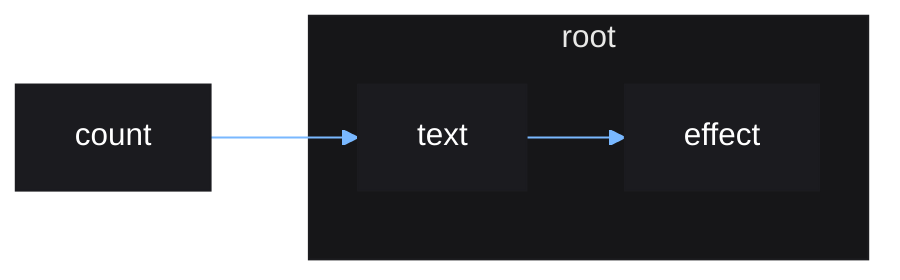

# Concepts Summary

A summary of all the concepts covered during the crash course.

## Source

A source of data.

Stores a single value that can be updated by the user.

## Effect

Anything that happens in reponse to a source update.

Vide has built-in functions to create effects such as

- `effect()` - runs arbitrary user code on source update
- `derive()` - updates a derived source on source update

## Reactive Scope

A scope created by certain Vide functions where source updates can be tracked,
and cleanups queued.

When a source used inside a reactive scope is updated, the reactive scope will
rerun.

Reactive scopes are created by functions such as

- `root()`
- `effect()`
- `derive()`

## Owner

A reactive scope created within an outer reactive scope, is *owned* by the outer
reactive scope.

When a reactive scope is re-ran or destroyed, all reactive scopes owned by it
are also destroyed.

Vide does not let you create reactive scopes without owners.

## Root Reactive Scope

A top-level reactive scope. These scopes are an exception to the owner rule.

Created by `root()`, which `mount()` uses internally.

A root reactive scope can be created on its own. It allows other reactive scopes
to be created with an owner.

Root reactive scopes must be destroyed manually by the user, a function to do
this is given by `root()`.

A root reactive scope can be created within another reactive scope and it will
not automatically be owned by that scope.

## Cleanup

Cleans up the result from an effect.

Unneeded in most cases, a cleanup is arbitrary code that can be ran before
a reactive scope is rerun or destroyed, so that the result from the previous
run can be cleaned up. A cleanup can be queued by using `cleanup()` within
a reactive scope.

## Tracking

Reactive scopes are tracking by default, meaning sources read from within scope
will be tracked.

A reactive scope can be made temporarily non-tracking within `untrack()`, so
that any source used will be ignored. The only function that creates a
nontracking reactive scope by default is `root()`.

## Reactive Graph

The combination of reactive scopes can viewed graphically, called a
*reactive graph*. This can be a more intuitive way to think of the
relationships between effects and the sources they depend on.

### Code

```lua
local count = source(0)

root(function()
    local text = derive(function()
        return "count: " .. text()
    end)

    effect(function()
        print(text())
    end)
end)
```

### Graph resulting from code



Notes:

- Since `count` is a source, not an effect, it can exist
  outside of a root reactive scope.
- An update to `count` will cause `text` to rerun, which
  then causes `effect` to rerun.
- When the root reactive scope is destroyed, `text` and
  `effect` will be destroyed alongside it, since they are
  owned by it. `count` will be untouched and future updates
  to `count` will have no effect.
