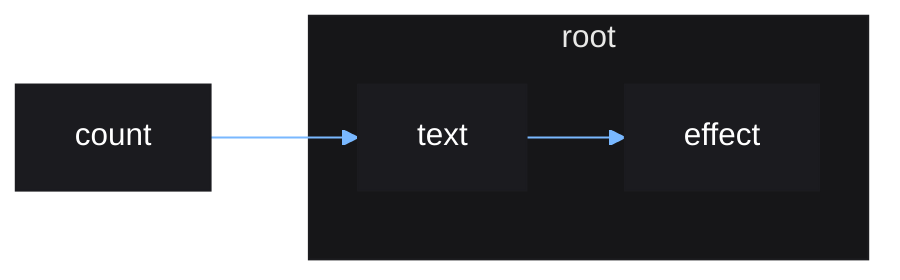

# Concepts Summary

A summary of all the concepts covered during the crash course.

## Source

A source of data.

Stores a single value that can be updated.

Created with `source()`.

# Derived Source

A new source composed of other sources.

Created with a plain function or with `derive()`.

## Effect

Anything that happens in response to a source update.

Created with `effect()`.

## Reactive Scope

A scope created by certain functions such as:

- `root()`
- `effect()`
- `derive()`

Reactive scopes can:

- track sources that are read from within.
- rerun when a tracked source updates.
- track new reactive scopes created from within.

## Scope Owners

A reactive scope created within another reactive scope is *owned* by the other
reactive scope, with the exception of the reactive scope created by `root()`.

When a reactive scope is rerun or destroyed, all reactive scopes owned by it are
automatically destroyed.

`root()`, which `mount()` uses internally, creates a reactive scope with no
owner, since it must be destroyed manually using a destructor
returned.

## Cleanup

Arbitrary code to run whenever a reactive scope is rerun or destroyed.

Queue a function to run using `cleanup()`.

## Tracking

Sources read from within a reactive scope will be tracked. This can be disabled
using `untrack()`, which will make reactive scopes temporarily ignore sources
read.

The reactive scope created by `root()` is non-tracking by default.

As a guard against misusage, a reactive scope cannot be created within a
reactive scope, unless it is made non-tracking using `untrack()`.

## Reactive Graph

The combination of reactive scopes can viewed graphically, called a
*reactive graph*. This can be a more intuitive way to think of the
relationships between effects and the sources they depend on.

### Code

```lua
local count = source(0)

root(function()
    local text = derive(function()
        return "count: " .. text()
    end)

    effect(function()
        print(text())
    end)
end)
```

### Graph resulting from code



Notes:

- Since `count` is a source, not an effect, it can exist
  outside of a root reactive scope.
- An update to `count` will cause `text` to rerun, which
  then causes `effect` to rerun.
- When the root reactive scope is destroyed, `text` and
  `effect` will be destroyed alongside it, since they are
  owned by it. `count` will be untouched and future updates
  to `count` will have no effect.
