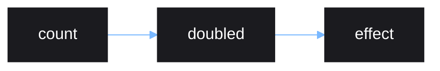

# Effects

Effects are functions that are ran in response to source updates. They are
called effects because they cause *side-effects* when reacting to source updates.

Effects are created using `effect()`.

```lua
local source = vide.source
local effect = vide.effect

local count = source(0)

effect(function()
    print("count: " .. count())
end)

-- "count: 0" printed
count(1)
-- "count: 1" printed
```

The callback given to `effect()` is ran in a *reactive scope*. Any source read
from inside a reactive scope will be tracked, so that if any of those sources
update, the effect will be reran too.

The callback is first ran immediately inside the `effect()` call to initially
figure out what sources are being used.

Effects also work with derived sources, it doesn't matter how deeply nested a
source is.

```lua
local source = vide.source
local effect = vide.effect

local count = source(1)

local doubled = function()
    return count() * 2
end

effect(function()
    print("doubled count: " .. doubled())
end)

-- "doubled count: 2" printed
count(2)
-- "doubled count: 4" printed
```

Derived sources should be a *pure computation*. A pure computation is one where
the same input will always produce the same output.

All observable changes to the user are considered to be side-effects of pure
computations.

Sources, derived sources, and effects form what is called a *reactive graph*.
In the above example, the following graph is formed. Anywhere
an update occures, everything further down the graph is updated.



You should not update other sources using an effect. Improper usage can lead to
a cyclic loop in the graph, causing an infinite loop when it tries to update.
Sources should be derived instead.

## Root Reactive Scopes

Effects must be created within another reactive scope. This is so that the
effect itself can be tracked and later freed when the parent reactive scope is
destroyed, such as from unmounting an app. The example code above will not
actually work unless it is ran inside a root reactive scope, such as one created
by `vide.mount(function)`. This generally isn't a concern since you can assume
that all your components will be created within a single `mount()` call, which
happens only once at the top level, where you put together your UI and parent it
to a ScreenGUI.
