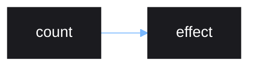

# Effects

Effects are functions that are ran in response to source updates. They are
called effects because they cause *side-effects* when reacting to source
updates.

Effects are created using `effect()`.

```lua
local source = vide.source
local effect = vide.effect

local count = source(0)

effect(function()
    print("count: " .. count())
end)

-- "count: 0" printed
count(1)
-- "count: 1" printed
```

The callback given to `effect()` is ran in a *reactive scope*. Any source read
from inside a reactive scope will be tracked, so that if any of those sources
update, the effect will be reran too.

The callback is first ran immediately inside the `effect()` call to initially
track sources used.

Effects also work with derived sources, it doesn't matter how deeply nested
inside a function a source is.

```lua
local source = vide.source
local effect = vide.effect

local count = source(1)

local doubled = function()
    return count() * 2
end

effect(function()
    print("doubled count: " .. doubled())
end)

-- "doubled count: 2" printed
count(2)
-- "doubled count: 4" printed
```

The reactive graph for the above example:


