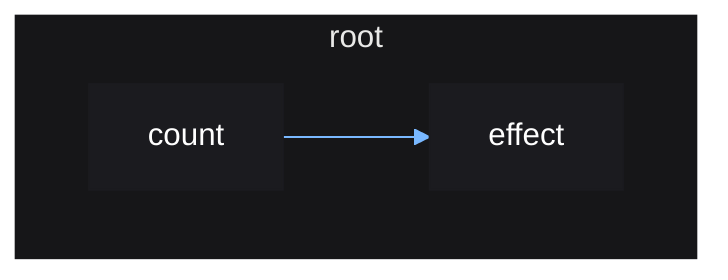

# Root Reactive Scopes

Reactive scopes cannot be created on their own - they must be created within
another reactive scope so that it can be tracked and later destroyed when it is
no longer needed.

This is the purpose of `mount()`, which creates an initial "root", or
"top-level" reactive scope, which all other reactive scopes, such as
ones created by `effect()`, can stem from.

When this root reactive scope is destroyed, it will ensure all other reactive
scopes created within it are also destroyed, ensuring everything is cleaned up
properly.

```lua
local source = vide.source
local effect = vide.effect

local function App()
    local count = source(0)

    effect(function()
        print(count())
    end)
end


App() -- will error since effect() was not called within a reactive scope

vide.mount(App) -- works!

```

Mounting returns a function that when called will destroy its reactive scope,
along with any other reactive scopes created inside it.

```lua
local unmount = mount(App)

unmount()
```

Vide's reactivity can be represented graphically, as a *reactive graph*.

The reactive graph for the above example looks like so:



When the root reactive scope created by `mount()` is destroyed, the `effect`
scope will also be destroyed since it was created within it.

This is important because you may have an effect that updates the property of a
UI instance, meaning the effect is referencing and holding that instance in
memory. The effect being destroyed will remove this reference, allowing the
instance to be garbage collected.

You don't need to worry about ensuring all your effects are created within a
root reactive scope, since you should be creating all your UI and corresponding
effects within a top-level `mount()` call that puts all your UI together. So it
is safe to assume that any effect you create will be created under this top
level scope. Vide will prevent you from accidently doing otherwise anyways.
