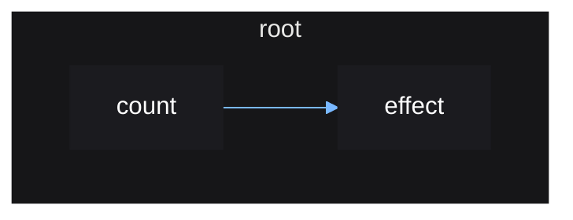

# Root Reactive Scopes

Any reactive scopes created, such as one from `effect()`, must be done so within
a "root" reactive scope. This is the main purpose of `mount()`, which you use
once at the top level to create your app as shown in the first introduction.

This is so that when the app is unmounted, it can clean up any reactive scopes
created within it, since reactive scopes track any reactive scopes created
within them.

```lua
local source = vide.source
local effect = vide.effect

local function App()
    local count = source(0)

    effect(function()
        print(count())
    end)
end

vide.mount(App) -- works!

App() -- will error since effect() was not called within a reactive scope
```

The reactive graph for the above example:


