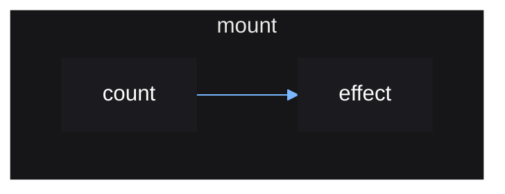

# Root Reactive Scopes

Any reactive scopes created, such as by `effect()`, must be done so within a
"root" reactive scope. This is the main purpose of `mount()`, which you use
once at the top level to create your app as shown in the first introduction.

This is so that when the app is unmounted, it can clean up any reactive scopes
created within it, since reactive scopes track any reactive scopes created
within them.

```lua
local source = vide.source
local effect = vide.effect

local function App()
    local count = source(0)

    effect(function()
        print(count())
    end)
end

vide.mount(App) -- works!

App() -- will error since effect() was not called within a reactive scope
```

Mounting returns a function that when called will destroy any reactive scopes
created during the `mount()` call.

```lua
local unmount = mount(App)

unmount()
```

Vide's reactivity can be represented graphically, as a *reactive graph*.

The reactive graph for the above example looks like so:



When the `mount` scope is destroyed, the `effect` scope will also be destroyed
since it was created within it.

You don't need to worry about ensuring all your effects are created within a
root scope, since you should be creating all your UI and corresponding effects
within a top-level `mount()` call that puts all your UI together. So it is safe
to assume that any effect you create will be created under this top level scope.
