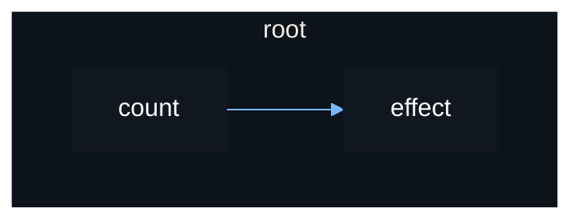

# Scopes

Just like how a signal's connection may need to be disconnected, a source's
effect also may need to be disconnected.

But the disconnecting of many signals and connections is tedious and verbose.
Vide instead operates on the concept of scopes which provides a much cleaner
API, given that you follow a few rules.

Thre are two types of scopes: stable and reactive.

- A scope must be created within another scope.
- Stable scopes never rerun.
- Reactive scopes can rerun.
- A reactive scope cannot be created within another reactive scope, only within
  a stable scope.

An exception to the first rule is `root()`, which creates the initial scope that
you destroy manually with a destructor function it returns.

`root()` creates a stable scope.
`effect()` creates a reactive scope.

Whenever a scope is destroyed, any scope created within that scope is also
destroyed, and so on.

```luau
local root = vide.root
local source = vide.source
local effect = vide.effect

local count = source(0)

local function setup()
    effect(function()
        print(count())
    end)

    return count
end

setup() -- error, effect() tried to create a reactive scope with no stable scope

local destroy = root(setup) -- ok since effect() was called in a stable scope

count(1) -- prints "1"
count(2) -- prints "2"

destroy()

count(3) -- reactive scope created by effect() is destroyed, it does not rerun
```

Vide's reactivity can be represented graphically, as a *reactive graph*.

The reactive graph for the above example looks like so:



When the stable `root()` scope is destroyed, the reactive `effect()`
scope will also be destroyed since it was created within it.

This is important because you may have an effect that updates the property of a
UI instance, meaning the effect is referencing and holding that instance in
memory. The effect being destroyed will remove this reference, allowing the
instance to be garbage collected.

You don't need to worry about ensuring all your effects are created within a
stable scope, since you should be creating all your UI and effects within a
single top-level `root()` call that puts all your UI together, making it safe to
assume any effect created will be created under this stable scope.
