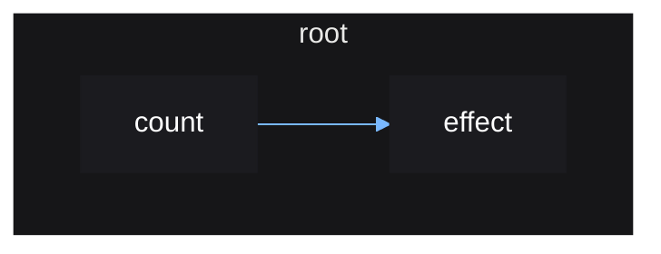

# Scopes

Vide operates on the concept of scopes. Vide scopes come in two flavors:
stable and reactive.

The three main rules for scopes are:

- Stable scopes never rerun.
- Reactive scopes will rerun on source updates.
- A reactive scope cannot be created within another reactive scope.

Reactive scopes cannot be created on their own - they must be created within
a stable scope so that it can be tracked and later destroyed when it is
no longer needed.

This is the purpose of `root()`, which creates an initial stable scope, which
all other reactive scopes, such as ones created by `effect()`, can stem from.

When this root reactive scope is destroyed, it will destroy any effects created
within it, ensuring everything is cleaned up properly.

```lua
local source = vide.source
local effect = vide.effect

local function setup()
    local count = source(0)

    effect(function()
        print(count())
    end)

    return count
end

setup() -- will error since effect() was not called within a stable scope

local count = vide.root(setup) -- runs
count(1) -- prints "1"
```

The scope created by `root()` can be destroyed by calling the function it passes
into the given function.

```lua
local function setup(destroy)
    local count = source(0)

    effect(function()
        print(count())
    end)

    return count, destroy
end

local count, destroy = root(setup)

count(1) -- prints "1"

destroy()

count(2) -- effect is destroyed; no longer prints
```

Vide's reactivity can be represented graphically, as a *reactive graph*.

The reactive graph for the above example looks like so:



When the root reactive scope created by `root()` is destroyed, the `effect`
scope will also be destroyed since it was created within it.

This is important because you may have an effect that updates the property of a
UI instance, meaning the effect is referencing and holding that instance in
memory. The effect being destroyed will remove this reference, allowing the
instance to be garbage collected.

You don't need to worry about ensuring all your effects are created within a
root reactive scope, since you should be creating all your UI and corresponding
effects within a top-level `root()` call that puts all your UI together. So it
is safe to assume that any effect you create will be created under this top
level scope. Vide will prevent you from accidently doing otherwise anyways.
