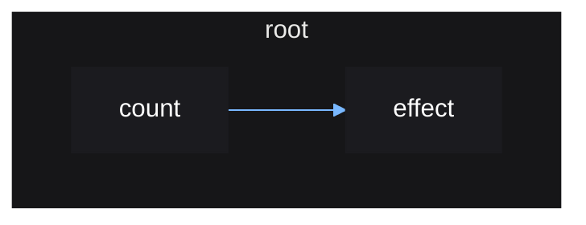

# Scopes

Just like how a signal's connection may need to be disconnected, a source's
effect also may need to be disconnected.

But the disconnecting of many signals and connections is tedious and verbose.
Vide instead operates on the concept of scopes which provides a much cleaner
API, given that you follow a few rules.

Scopes come in two flavors; stable and reactive.

- All scopes must be created within another scope with the exception of `root()`
- Stable scopes never rerun
- Reactive scopes can rerun
- A reactive scope cannot be created within another reactive scope

`effect()` creates a reactive scope.
`root()` creates a stable scope.

Whenever a scope is destroyed, any scope created within that scope is also
destroyed, and so on. This is why all scopes must be created within another
scope, except `root()` which is used to create the initial scope that you can
manually destroy.

```luau
local root = vide.root
local source = vide.source
local effect = vide.effect

local function setup()
    local count = source(0)

    effect(function()
        print(count())
    end)

    return count
end

setup() -- will error since effect() tries to create a reactive scope outside of a stable scope

local count = root(setup) -- ok since effect() was called within a stable scope
count(1) -- prints "1"
```

The scope created by `root()` can be destroyed.

```luau
local function setup()
    local count = source(0)

    effect(function()
        print(count())
    end)

    return count
end

local destroy, count = root(setup)

count(1) -- prints "1"

destroy()

count(2) -- effect is destroyed; no longer prints
```

Vide's reactivity can be represented graphically, as a *reactive graph*.

The reactive graph for the above example looks like so:



When the stable `root()` is destroyed, the reactive `effect()`
scope will also be destroyed since it was created within it.

This is important because you may have an effect that updates the property of a
UI instance, meaning the effect is referencing and holding that instance in
memory. The effect being destroyed will remove this reference, allowing the
instance to be garbage collected.

You don't need to worry about ensuring all your effects are created within a
stable scope, since you should be creating all your UI and effects within a
single top-level `root()` call that puts all your UI together, making it safe to
assume any effect created will be created under this stable scope.
