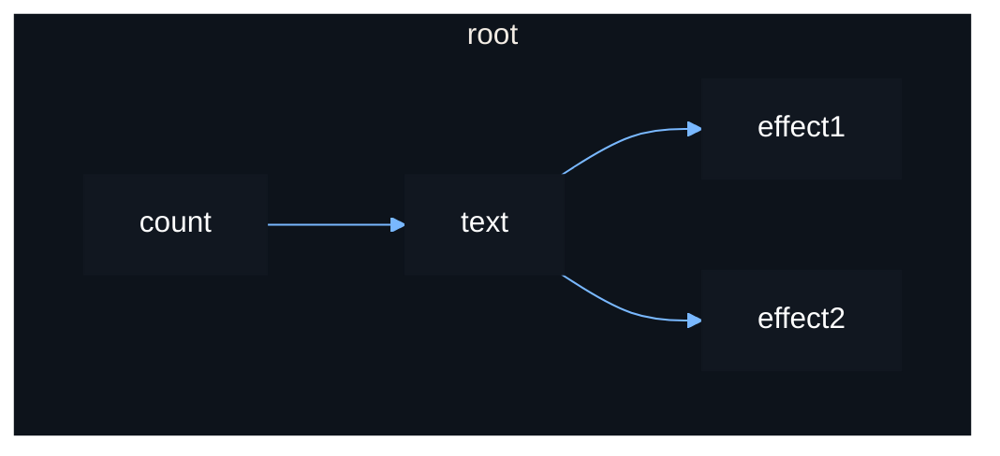

# Derived Sources

We have seen the basic way to derive a source:

```luau
local count = source(0)

local text = function()
    return "count: " .. tostring(count())
end

print(text()) -- "count: 0"
count(1)
print(text()) -- "count: 1"
```

However, in some cases where this source could be used by multiple effects at
the same time, the function wrapping the source will needlessly rerun to convert
the count into a string for each effect using it.

```luau
local source = vide.source
local effect = vide.effect

local count = source(0)

local text = function()
    print "ran"
    return "count: " .. tostring(count())
end

effect(function() text() end)
effect(function() text() end)

count(1) -- prints "ran" x2
```

To avoid this, you can use `derive()` to derive a new source instead. This will
run a function in a reactive scope only when a source used inside updated.
Reading this derived source multiple times will just return a cached result.

```luau
local source = vide.source
local effect = vide.effect
local derive = vide.derive

local count = source(0)

local text = derive(function()
    print "ran"
    return "count: " .. tostring(count())
end)

effect(function() text() end)
effect(function() text() end)

count(1) -- prints "ran" x1
```

Because `derive()` creates a reactive scope, it must be called within a stable
scope, just like `effect()`.

If the recalculated value is the same as the old value, the derived source will
not rerun the effects using it.

The reactive graph for the above example:



Deriving a source in this manner is similar to creating an effect to update
another source. You should avoid doing this using an effect however.
Improper usage could accidently create infinite loops in the reactive graph.
Always favour deriving when you need one source to update based on another
source.
