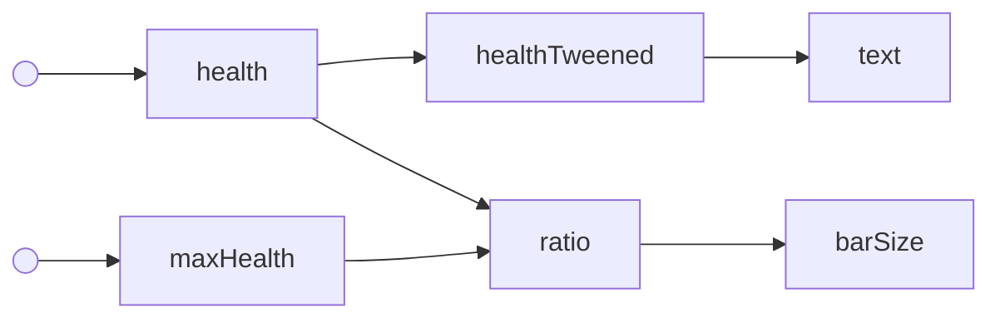
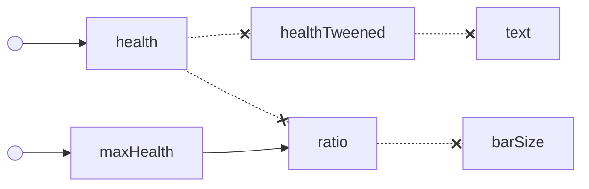

# Vide Reactive Graph

Details on how Vide's reactive graph works.

## Nodes

A "node" refers to a point on the reactive graph.

- Nodes can have parents and children.
- Updating a node will mark all descendant nodes for update.
- Each Vide state object acts as a node on the reactive graph.

Vide's reactive graph uses a *lazy evaluation* model, meaning that
if a node with children is updated, the new value for the child node
is not recalculated immediately. Only when something attempts to access
the child's value is it recalculated.

## Example

Below is an (*overengineered*) example to demonstrate how the reactive graph functions.
States are used here to model the various transforms done on two inputs, `health` and `maxHealth`
to represent player health for UI.

```lua
local health = wrap(90)
local maxHealth = wrap(100)

local healthTweened = spring(health, 0.5)
local text = "Health: " .. healthTweened

local ratio = health / maxHealth

local barSize = derive(function(from)
    return UDim2.fromScale(from(ratio), 1)
end
```

Below is a graphical representation of the reactive graph formed by the above code.



When states are initially derived, all values are known.

Say if the player is damaged, and the `health` node changes value.
All descendant nodes from `health` will be marked as updated.
The nodes marked as updated are represented by the broken lines below.



When something tries to read the value of the node `text`, a recalculation occurs.
While `text` is being recalculated, `healthTweened` will be read from, causing it to be recalculated as well.
This results in a chain that propogates up the reactive graph until all ancestors are up to date.

Below is what the graph will look like after `text` has been recalculated.


Lazy evaluation is a useful model as it saves unecessary calculation, only calculating when needed.

Looking at stateful code as a reactive graph is a good way to mentally picture how your data maps to UI.
